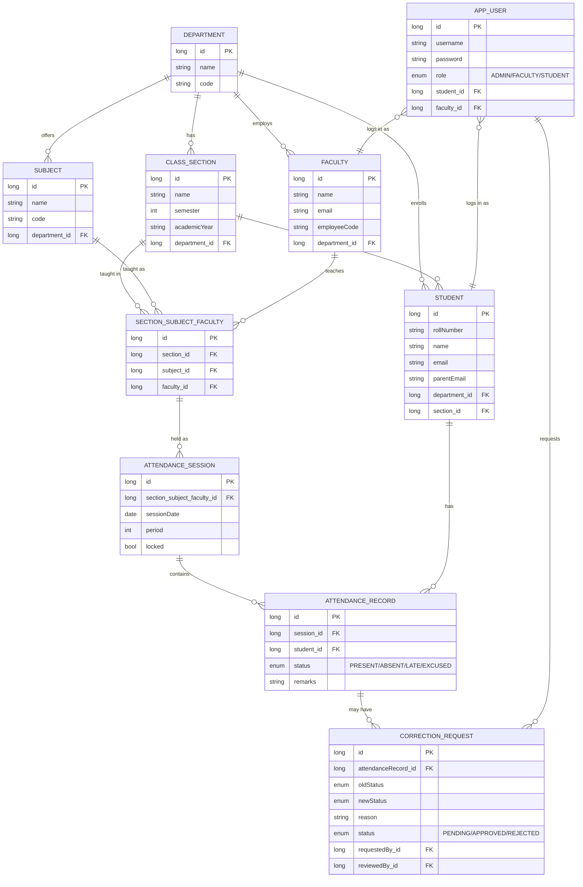
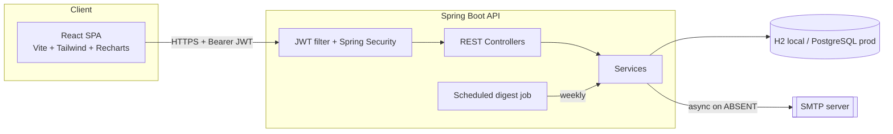

# Attendo — College Attendance Management System

A full-stack attendance system for a ~5,000-student, 200-faculty college: multiple departments,
sections, subjects, and class periods. Built with **React (Vite)** on the front end and
**Spring Boot** on the back end, with **automatic email alerts** the moment a student is marked
absent, plus a weekly low-attendance digest.

---

## 1. Users, roles & permissions

| Role | Who | Can do |
|---|---|---|
| **Admin** | Registrar / attendance office | Create departments, sections, subjects, faculty, students; assign faculty to (section, subject) pairs; approve/reject correction requests; view every report |
| **Faculty** | Teaching staff | Take attendance for their own assigned classes; view their own students' history; raise correction requests for their own past sessions |
| **Student** | Enrolled student | View their own attendance %, subject-wise breakdown, and full history — read-only |

Permissions are enforced **server-side** with Spring Security method annotations
(`@PreAuthorize`) on every endpoint, not just hidden in the UI — a student token cannot call
faculty or admin endpoints even by hitting the API directly.

A JWT issued at login carries the username and role; the frontend stores it and attaches it as
`Authorization: Bearer <token>` on every request.

---

## 2. Core workflows

**Recording attendance**
1. Faculty picks their class (section + subject), a date, and a period, and loads the roster.
2. The system creates (or reuses) one `AttendanceSession` for that (class, date, period) — so
   attendance for a given period can only be entered once.
3. Faculty marks each student Present / Absent / Late / Excused (with a one-click "mark all
   present"), and submits.
4. On submit, the session is **locked**. Any student newly marked **Absent** triggers an
   immediate email (see below). The record set becomes the source of truth for reports.

**Corrections (the controlled way to fix a locked session)**
1. Faculty selects a specific student's record in an already-submitted session and requests a
   fix, with a reason (e.g. "marked absent by mistake during roll call").
2. This creates a `PENDING` `CorrectionRequest` — the original record is **not** changed yet.
3. Admin reviews pending requests and Approves or Rejects. Approval applies the new status to
   the actual `AttendanceRecord` (and fires an absence email if the corrected status is now
   Absent). Rejection leaves the record untouched.
4. This gives a full audit trail: nobody can silently rewrite attendance after the fact.

**Review & history**
- Students see their own running % and a full session-by-session history at any time.
- Faculty and admins can pull up any student's summary (overall % + per-subject breakdown).

**Identifying low attendance**
- `GET /api/reports/low-attendance?threshold=75` returns every student under the threshold,
  sorted worst-first, with present/total counts — used by the Admin "Low Attendance" tab and by
  the weekly email digest.

**Email notifications**
- **Immediate**: the moment a student is marked (or corrected to) Absent, `EmailService` sends
  an async email to the student and, if on file, a parent/guardian email.
- **Weekly digest**: a scheduled job (`LowAttendanceScheduler`, default Monday 8 AM,
  configurable via cron) emails every student below the threshold a subject-wise breakdown.
- Email sending is **off by default** locally (`MAIL_ENABLED=false`) so nobody needs real SMTP
  credentials just to try the app — messages are logged instead of sent. Flip it on with real
  SMTP creds to actually deliver mail (see §6).

---

## 3. Data model



`SectionSubjectFaculty` is the pivot that answers "who teaches what, to whom" — every
`AttendanceSession` hangs off one of these, which is what lets a faculty member only ever see
and mark their own classes.

---

## 4. Architecture



- **Stateless REST API** — no server-side sessions; the JWT is the only auth state, so the
  backend scales horizontally without sticky sessions.
- **Layered backend**: Controller → Service → Repository (Spring Data JPA), with a
  `GlobalExceptionHandler` turning domain exceptions into clean JSON error responses.
  Bulk-marking a whole class is a single transaction.
- **Async, non-blocking email** (`@Async` + `@EnableAsync`) — sending mail never slows down the
  faculty member submitting attendance.
- **DB-agnostic seeding** — a `CommandLineRunner` (`DataSeeder`) populates realistic demo data
  through JPA (not raw SQL), so it works identically against H2 locally or Postgres in
  production/Docker, and safely no-ops once real data exists.
- **Profiles**: `local` (H2 file DB, zero install) and `prod` (Postgres via env vars) — same
  jar, different `application-{profile}.yml`.

---

## 5. Tech stack

| Layer | Choice |
|---|---|
| Frontend | React 18, Vite, Tailwind CSS, React Router, Recharts, Axios, react-hot-toast |
| Backend | Spring Boot 3.3 (Web, Security, Data JPA, Validation, Mail), Java 17 |
| Auth | JWT (jjwt), BCrypt password hashing |
| Database | H2 (local file DB) / PostgreSQL (production) |
| Deployment | Docker, Render/Railway (backend), Neon (Postgres), Vercel/Netlify (frontend) — all free tiers |

---

## 6. Running it locally

### Option A — fastest, no Docker, no external DB

**Backend** (needs JDK 17 + Maven):
```bash
cd backend
mvn spring-boot:run
```
This runs on the `local` profile by default: an H2 file database is created at
`backend/data/attendance-db`, and demo data is seeded automatically on first boot.
API is at `http://localhost:8080`. H2 console (if you want to poke the DB directly) is at
`http://localhost:8080/h2-console` (JDBC URL `jdbc:h2:file:./data/attendance-db`, user `sa`, no
password).

**Frontend** (needs Node 18+):
```bash
cd frontend
cp .env.example .env    # VITE_API_URL=http://localhost:8080
npm install
npm run dev
```
Open `http://localhost:5173`.

### Option B — full stack via Docker Compose (Postgres, closer to production)

From the repo root:
```bash
docker compose up --build
```
This starts Postgres, the backend (`prod` profile, port 8080), and the frontend served via
nginx (port 5173). Demo data seeds automatically the first time the Postgres volume is empty.
Email is off by default in compose too (`MAIL_ENABLED=false`) — set real SMTP env vars in
`docker-compose.yml` to enable it.

### Demo credentials (both options)

| Username | Password | Role |
|---|---|---|
| `admin` | `admin123` | Admin |
| `anita.rao` | `password123` | Faculty (teaches Data Structures, Section CSE-3-A) |
| `CSE21001` … `CSE21008` | `password123` | Students in Section CSE-3-A |

---

## 7. Turning on real email

Locally or in Docker, set these environment variables and `MAIL_ENABLED=true`:

```
MAIL_ENABLED=true
MAIL_HOST=smtp.gmail.com
MAIL_PORT=587
MAIL_USERNAME=your-address@gmail.com
MAIL_PASSWORD=your-16-char-app-password   # not your normal Gmail password
MAIL_FROM=your-address@gmail.com
```

Gmail requires an **App Password** (Google Account → Security → 2-Step Verification → App
Passwords) since normal passwords are blocked for SMTP. For a free alternative with a generous
quota and no personal-account risk, **Brevo** (formerly Sendinblue) gives 300 free emails/day —
sign up, grab their SMTP credentials, and use `smtp-relay.brevo.com:587` instead.

---

## 8. Deploying for free

**Backend → Render (free web service)**
1. Push this repo to GitHub.
2. On [render.com](https://render.com), New → Web Service → connect the repo, root directory
   `backend`, and let Render detect the `Dockerfile` (or choose "Docker" runtime explicitly).
3. Add environment variables: `SPRING_PROFILES_ACTIVE=prod`, `DATABASE_URL`,
   `DATABASE_USERNAME`, `DATABASE_PASSWORD` (from step below), `JWT_SECRET` (any random 32+
   char string), and the `MAIL_*` variables if you want real email.
4. Deploy. Render's free web services spin down after inactivity and cold-start on the next
   request — fine for a demo/college project, not for guaranteeing instant page loads.

**Database → Neon (free Postgres)**
1. Create a free project at [neon.tech](https://neon.tech).
2. Copy the connection details into Render as `DATABASE_URL` in JDBC form:
   `jdbc:postgresql://<host>/<db>?sslmode=require`, plus `DATABASE_USERNAME` /
   `DATABASE_PASSWORD` from Neon's dashboard.
3. First boot creates all tables automatically (`ddl-auto: update`) and seeds demo data.

*(Railway's free Postgres add-on, or Supabase's free Postgres, work identically — just swap
the connection string.)*

**Frontend → Vercel (or Netlify)**
1. Import the repo into [vercel.com](https://vercel.com), set root directory to `frontend`.
2. Set the environment variable `VITE_API_URL` to your Render backend's public URL
   (e.g. `https://attendo-backend.onrender.com`).
3. Deploy — Vercel auto-detects Vite. `vercel.json` in this repo already handles SPA routing.
   (A `netlify.toml` is included too if you prefer Netlify.)

That's a fully free, publicly reachable deployment: React on Vercel, Spring Boot on Render,
Postgres on Neon.

---

## 9. API reference (summary)

| Method | Endpoint | Role |
|---|---|---|
| POST | `/api/auth/login` | public |
| GET/POST | `/api/admin/departments`, `/sections`, `/subjects`, `/faculty`, `/students`, `/assignments` | GET: admin+faculty · POST: admin |
| POST | `/api/attendance/sessions` | faculty/admin |
| GET | `/api/attendance/sessions/{id}` | faculty/admin |
| POST | `/api/attendance/sessions/{id}/mark` | faculty/admin |
| GET | `/api/attendance/students/{id}/history` | student/faculty/admin |
| POST | `/api/corrections` | faculty/admin |
| GET | `/api/corrections?status=PENDING` | admin/faculty |
| PUT | `/api/corrections/{id}/approve` \| `/reject` | admin |
| GET | `/api/reports/students/{id}/summary` | student/faculty/admin |
| GET | `/api/reports/low-attendance?threshold=75` | admin/faculty |

---

## 10. Project structure

```
college-attendance-system/
├── backend/                  Spring Boot API
│   ├── src/main/java/com/college/attendance/
│   │   ├── entity/           JPA entities
│   │   ├── repository/       Spring Data repositories
│   │   ├── dto/               Request/response records
│   │   ├── service/           Business logic + email
│   │   ├── controller/        REST endpoints
│   │   ├── config/             Security, JWT, seeding, Jackson
│   │   ├── scheduler/          Weekly low-attendance digest
│   │   └── exception/          Global error handling
│   ├── src/main/resources/application*.yml
│   └── Dockerfile
├── frontend/                 React (Vite) SPA
│   ├── src/pages/             Login, AdminDashboard, FacultyDashboard, StudentDashboard
│   ├── src/components/        Layout, AttendanceGrid, Badges, Shared (Modal/Tabs)
│   ├── src/api/                Axios client + endpoint helpers
│   ├── src/context/             Auth context (JWT storage)
│   ├── Dockerfile, nginx.conf, vercel.json, netlify.toml
└── docker-compose.yml         One command: Postgres + backend + frontend
```

---

## 11. Known limitations & natural next steps

- No self-service password reset / "forgot password" flow yet.
- One period = one session; there's no built-in weekly timetable/calendar view (an assignment
  can be scheduled for any date/period faculty chooses, which is flexible but manual).
- No bulk CSV import for onboarding all 5,000 students / 200 faculty at once — today they're
  added one at a time via the Admin tabs or the `POST /api/admin/students` API (which a CSV
  importer could simply loop over).
- No file/photo attachment on correction requests (e.g. a medical certificate scan).
- Render's free tier cold-starts after idling; for always-on hosting, a small paid instance
  removes that delay without any other code changes.
